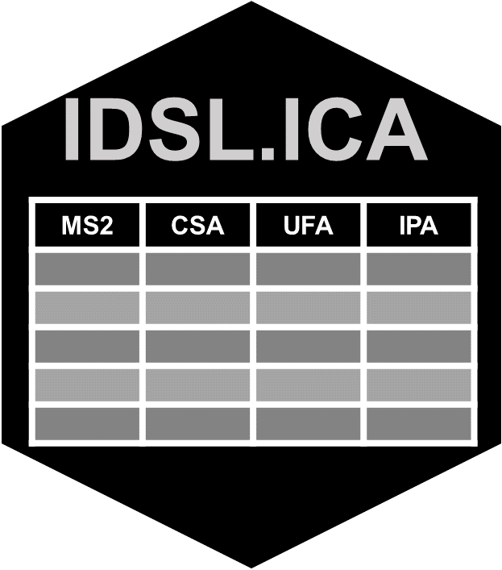

# IDSL.ICA

<!-- badges: start -->

<!-- badges: end -->

**Integrated Compound Annotation (ICA)** by the [**Integrated Data Science Laboratory for Metabolomics and Exposomics (IDSL.ME)**](https://www.idsl.me/) is a computational workflow to facilitate integration of the annotated metabolomics data which can then be used for multi-omics analyses. The **IDSL.ICA** workflow integrates several existing tools including [IDSL.IPA](https://github.com/idslme/IDSL.IPA), [IDSL.UFA](https://github.com/idslme/IDSL.UFA) and [IDSL.CSA](https://github.com/idslme/IDSL.CSA) to enable comprehensive annotation of metabolites detected in a given batch of samples.

## Installation

	 pending install.packages("IDSL.CSA") pending
	 
## [vignettes](https://github.com/idslme/IDSL.ICA/blob/main/ICA_educational_files/vignettes/Integrated_Compound_Annotation.pdf)